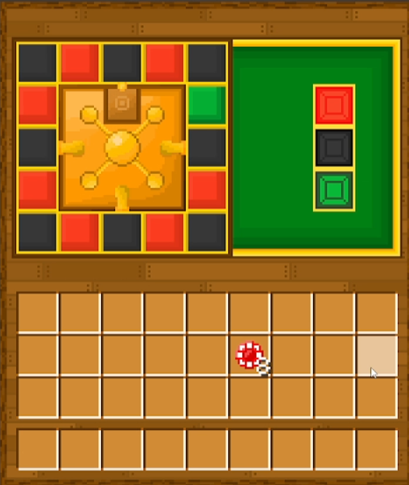

# 🎰 CassinoRamon – Mod de Cassino para Minecraft (Fabric)

  

---

## 🃏 Sobre

**Cassino** é um mod de cassino para Minecraft feito com Fabric, trazendo jogos de azar, economia virtual, ranking e muita emoção para seu servidor ou mundo singleplayer!

---

## ✨ Funcionalidades

- **Roleta:** Aposte e teste sua sorte!  
- **Economia própria:** Gerencie saldo dos jogadores no mod.
- **Ranking:** Veja os jogadores mais sortudos.
- **Configuração fácil:** Odds, prêmios e limites customizáveis em arquivo.
- **Sistema seguro:** Prevenção de abuso, logs internos, fácil integração.
- **100% Fabric:** Compatível com as versões modernas do Minecraft.

---

## 🚀 Instalação

1. **Baixe a última versão do mod** na [página de releases](https://github.com/seuusuario/CassinoRamon/releases).
2. **Coloque o arquivo `.jar` na pasta `mods/`** do seu Minecraft Fabric 1.21.1.
3. **Execute o jogo normalmente.**

---

## 💬 Comando Principal

- **/roleta** – Acesse o sistema de roleta para apostar seus coins do cassino.

**Permissão:**  
Todos podem usar `/roleta` por padrão, mas é possível limitar a grupos via config ou integração com mods de permissão.

# 🎰 CassinoRamon – Mod de Cassino para Minecraft (Fabric)

  
  
  
  
  

---

## 🃏 Sobre

**CassinoRamon** é um mod de cassino para Minecraft feito com Fabric, trazendo jogos de azar, economia virtual, ranking e muita emoção para seu servidor ou mundo singleplayer!

---

## ✨ Funcionalidades

- **Roleta:** Aposte e teste sua sorte!  
- **Economia própria:** Gerencie saldo dos jogadores no mod.
- **Ranking:** Veja os jogadores mais sortudos.
- **Configuração fácil:** Odds, prêmios e limites customizáveis em arquivo.
- **Sistema seguro:** Prevenção de abuso, logs internos, fácil integração.
- **100% Fabric:** Compatível com as versões modernas do Minecraft.

---

## 🚀 Instalação

1. **Baixe a última versão do mod** na [página de releases](https://github.com/seuusuario/CassinoRamon/releases).
2. **Coloque o arquivo `.jar` na pasta `mods/`** do seu Minecraft Fabric 1.20.1+.
3. **Execute o jogo normalmente.**

---

## 💬 Comando Principal

- **/roleta** – Acesse o sistema de roleta para apostar seus coins do cassino.

**Permissão:**  
Todos podem usar `/roleta` por padrão, mas é possível limitar a grupos via config ou integração com mods de permissão.

---

## 📸 Screenshots

  <b>🎲 Menu da Roleta</b> 
  

---
